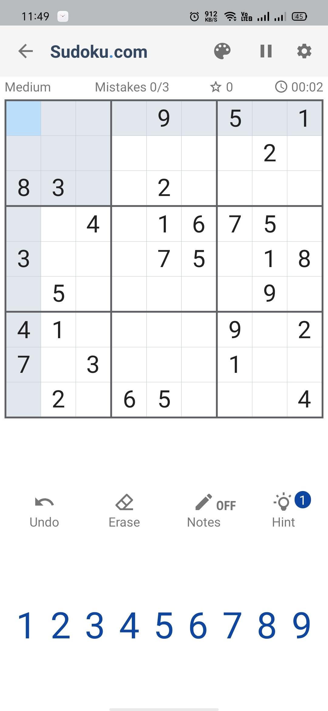
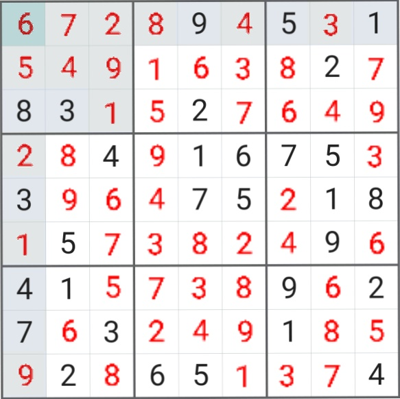

Created a solution that can read sudoku table from image, solve it as a human would with my own methods and add solution numbers to the same image and also give steps to solve it

Uses a custom deep neural network to recognise digits from the sudoku image

[Train Sudoku Solver](Train%20Sudoku%20Solver.ipynb) file has the code to create and train the model with the data from [Digitdata folder](Digitdata)

[Sudoku Solver](Sudoku%20Solver.ipynb) file has the code to read the sudoku image from path, load the model, solve it and print the steps involved to solve the sudoku.

* Sudoku input image path is given in the vairable sudoku1_path in the file [here](Sudoku%20Solver.ipynb#Input-path-here)

## Example:

### Input Sudoku

### Output Sudoku
